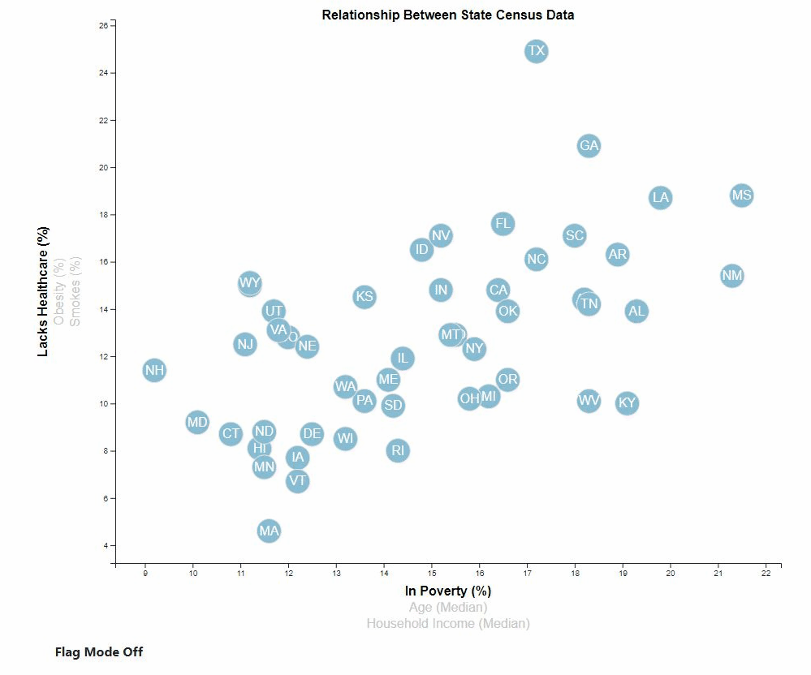

# State Health Visualization

This project uses DJ.js to show relationships between various features of the 2014 ACS 1-year estimates. By clicking on the different axis labels, you are able quickly compare one feature to another. As the selected features change, the graph updates to reflect the new comparisons. By hovering over a point on the graph, you'll see a tooltip that contains the state that you're hovering over along with the data that is currently being reflected on the graph. To explore the graph yourself, you can visit https://connorhz.github.io/StateHealthVisualization/

A bonus feature of the visualization is "Flag Mode". Each points on the graph can be changed to show the flag of the state the point represents. All of the state flag images are from [CountryFlags.com](https://www.countryflags.com/)

## Technologies Used

- HTML/Javascript/CSS
- [D3.js](https://d3js.org/)
- [Bootstrap Toggle](https://www.bootstraptoggle.com/)
